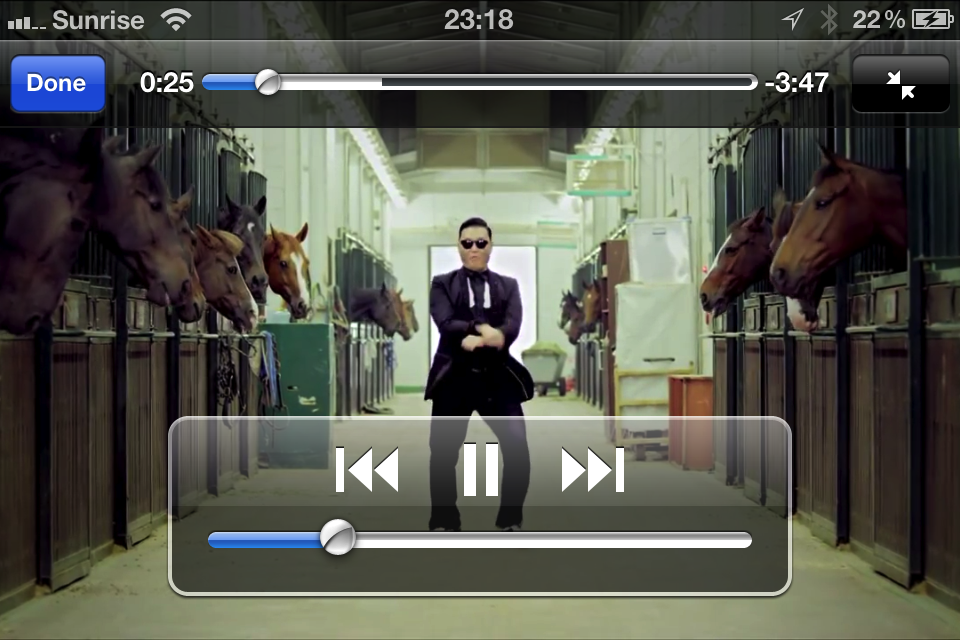

## About

[](https://travis-ci.org/0xced/XCDYouTubeKit)
[](https://coveralls.io/r/0xced/XCDYouTubeKit?branch=master)
[](http://cocoadocs.org/docsets/XCDYouTubeKit/)
[](http://cocoadocs.org/docsets/XCDYouTubeKit/)
[](LICENSE)

**XCDYouTubeKit** is a YouTube video player for iOS and OS X.



Are you enjoying XCDYouTubeKit? You can say thank you with [a tweet](https://twitter.com/intent/tweet?text=%400xced%20Thank%20you%20for%20XCDYouTubeKit%2E). I am also accepting donations. ;-)

[](https://www.paypal.com/cgi-bin/webscr?cmd=_s-xclick&hosted_button_id=MGEPRSNQFMV3W)

## Requirements

- Runs on iOS 5.0 and later
- Runs on OS X 10.7 and later

## Warnings

* XCDYouTubeKit is against the YouTube [Terms of Service](https://www.youtube.com/t/terms). The only *official* way of playing a YouTube video inside an app is with a web view and the [iframe player API](https://developers.google.com/youtube/iframe_api_reference). Unfortunately, this is very slow and quite ugly, so I wrote this player to give users a better viewing experience.

* Except for live videos, the player uses progressive download. Remember that some restrictions apply if you submit your app to the App Store, as stated in 
[HTTP Live Streaming — Requirements for Apps](https://developer.apple.com/library/ios/documentation/NetworkingInternet/Conceptual/StreamingMediaGuide/UsingHTTPLiveStreaming/UsingHTTPLiveStreaming.html#//apple_ref/doc/uid/TP40008332-CH102-SW5):
> **Warning**: iOS apps submitted for distribution in the App Store must conform to these requirements.
> 
> If your app delivers video over cellular networks, and the video exceeds either 10 minutes duration or 5 MB of data in a five minute period, you are required to use HTTP Live Streaming. (Progressive download may be used for smaller clips.)

## Installation

XCDYouTubeKit is available through CocoaPods.

```ruby
pod "XCDYouTubeKit", "~> 2.0.3"
```

Alternatively, you can manually use the provided static library on iOS or dynamic framework on OS X. In order to use the iOS static library, you must:

1. Create a workspace (File → New → Workspace…)
2. Add your project to the workspace
3. Add the XCDYouTubeKit project to the workspace
4. Drag and drop the `libXCDYouTubeKit.a` file referenced from XCDYouTubeKit → Products → libXCDYouTubeKit.a into the *Link Binary With Libraries* build phase of your app’s target.

These steps will ensure that `#import <XCDYouTubeKit/XCDYouTubeKit.h>` will work properly in your project.

**Warning**: If you use the iOS static library and you are targeting iOS 7, add the JavaScriptCore framework. If you are targeting iOS 5 or 6, you must add the following *Other Linker Flags* instead to your app:

```
-Wl,-U,_JSContextGetGlobalObject -Wl,-U,_JSEvaluateScript -Wl,-U,_JSGlobalContextCreate -Wl,-U,_JSGlobalContextRelease -Wl,-U,_JSObjectCallAsFunction -Wl,-U,_JSObjectIsFunction -Wl,-U,_JSObjectSetProperty -Wl,-U,_JSStringCopyCFString -Wl,-U,_JSStringCreateWithCFString -Wl,-U,_JSStringRelease -Wl,-U,_JSValueIsObject -Wl,-U,_JSValueIsString -Wl,-U,_JSValueMakeString -Wl,-U,_JSValueToStringCopy
```

See my [JavaScriptCore framework availability on iOS](http://stackoverflow.com/questions/23514579/javascriptcore-framework-availability-on-ios/23514580#23514580) answer on Stack Overflow for a complete explanation.


## Usage

XCDYouTubeKit is [fully documented](http://cocoadocs.org/docsets/XCDYouTubeKit/).

### iOS and OS X

```objc
NSString *videoIdentifier = @"EdeVaT-zZt4"; // A 11 characters YouTube video identifier
[[XCDYouTubeClient defaultClient] getVideoWithIdentifier:videoIdentifier completionHandler:^(XCDYouTubeVideo *video, NSError *error) {
	if (video)
	{
		// Do something with the `video` object
	}
	else
	{
		// Handle error
	}
}];
```

### iOS only

On iOS, you can use the class `XCDYouTubeVideoPlayerViewController` the same way you use a `MPMoviePlayerViewController`, except you initialize it with a YouTube video identifier instead of a content URL.

#### Present the video in full-screen

```objc
XCDYouTubeVideoPlayerViewController *videoPlayerViewController = [[XCDYouTubeVideoPlayerViewController alloc] initWithVideoIdentifier:@"9bZkp7q19f0"];
[self presentMoviePlayerViewControllerAnimated:videoPlayerViewController];
```

#### Present the video in a non full-screen view

```objc
XCDYouTubeVideoPlayerViewController *videoPlayerViewController = [[XCDYouTubeVideoPlayerViewController alloc] initWithVideoIdentifier:@"9bZkp7q19f0"];
[videoPlayerViewController presentInView:self.videoContainerView];
[videoPlayerViewController.moviePlayer play];
```

See the demo project for more sample code.

## Credits

The URL extraction algorithms in *XCDYouTubeKit* are inspired by the [YouTube extractor](https://github.com/rg3/youtube-dl/blob/master/youtube_dl/extractor/youtube.py) module of the *youtube-dl* project.

## Contact

Cédric Luthi

- http://github.com/0xced
- http://twitter.com/0xced

## License

XCDYouTubeKit is available under the MIT license. See the [LICENSE](LICENSE) file for more information.
