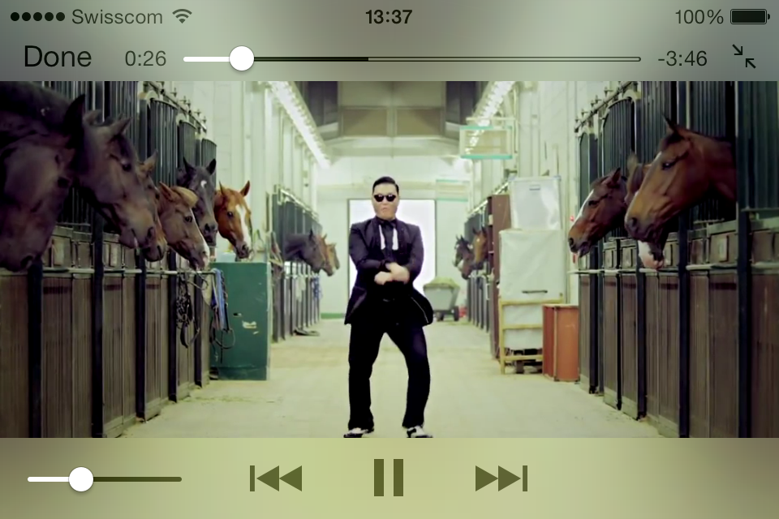

## About

[](https://travis-ci.org/0xced/XCDYouTubeVideoPlayerViewController)

**XCDYouTubeKit** is a YouTube video player for iOS and OS X.



To the best of my knowledge, the only *official* way of playing a YouTube video on iOS is with a UIWebView and the [iframe player API](https://developers.google.com/youtube/iframe_api_reference). Unfortunately, this is very slow and quite ugly, so I wrote this player to give users a better viewing experience.

Except for live videos, the player uses progressive download. Remember that some restrictions apply if you submit your app to the App Store, as stated in 
[HTTP Live Streaming — Requirements for Apps](https://developer.apple.com/library/ios/documentation/NetworkingInternet/Conceptual/StreamingMediaGuide/UsingHTTPLiveStreaming/UsingHTTPLiveStreaming.html#//apple_ref/doc/uid/TP40008332-CH102-SW5):
> **Warning**: iOS apps submitted for distribution in the App Store must conform to these requirements.
> 
> If your app delivers video over cellular networks, and the video exceeds either 10 minutes duration or 5 MB of data in a five minute period, you are required to use HTTP Live Streaming. (Progressive download may be used for smaller clips.)

## Requirements

- Runs on iOS 5.0 and later
- Runs on OS X 10.7 and later

## Installation

XCDYouTubeKit is available through CocoaPods.

Alternatively, you can manually use the provided static library on iOS or dynamic framework on OS X.


## Usage

XCDYouTubeKit is [fully documented](http://cocoadocs.org/docsets/XCDYouTubeKit/).

```
#import <XCDYouTubeKit/XCDYouTubeKit.h>`
```

### iOS and OS X

```objc
NSString *videoIdentifier = @"EdeVaT-zZt4"; // A 11 characters YouTube video identifier
[[XCDYouTubeClient defaultClient] getVideoWithIdentifier:videoIdentifier completionHandler:^(XCDYouTubeVideo *video, NSError *error) {
	if (video)
	{
		// Do something with the `video` object
	}
	else
	{
		// Handle error
	}
}];
```

### iOS only

On iOS, you can use the class `XCDYouTubeVideoPlayerViewController` the same way you use a `MPMoviePlayerViewController`, except you initialize it with a YouTube video identifier instead of a content URL.

#### Present the video in full-screen

```objc
XCDYouTubeVideoPlayerViewController *videoPlayerViewController = [[XCDYouTubeVideoPlayerViewController alloc] initWithVideoIdentifier:@"9bZkp7q19f0"];
[self presentMoviePlayerViewControllerAnimated:videoPlayerViewController];
```

#### Present the video in a non full-screen view

```objc
XCDYouTubeVideoPlayerViewController *videoPlayerViewController = [[XCDYouTubeVideoPlayerViewController alloc] initWithVideoIdentifier:@"9bZkp7q19f0"];
[videoPlayerViewController presentInView:self.videoContainerView];
[videoPlayerViewController.moviePlayer play];
```

See the demo project for more sample code.

## Credits

The URL exctraction algorithms in *XCDYouTubeKit* are inspired by the [YouTube extractor](https://github.com/rg3/youtube-dl/blob/master/youtube_dl/extractor/youtube.py) module of the *youtube-dl* project.

## Contact

Cédric Luthi

- http://github.com/0xced
- http://twitter.com/0xced

## License

XCDYouTubeKit is available under the MIT license. See the [LICENSE](LICENSE) file for more information.
